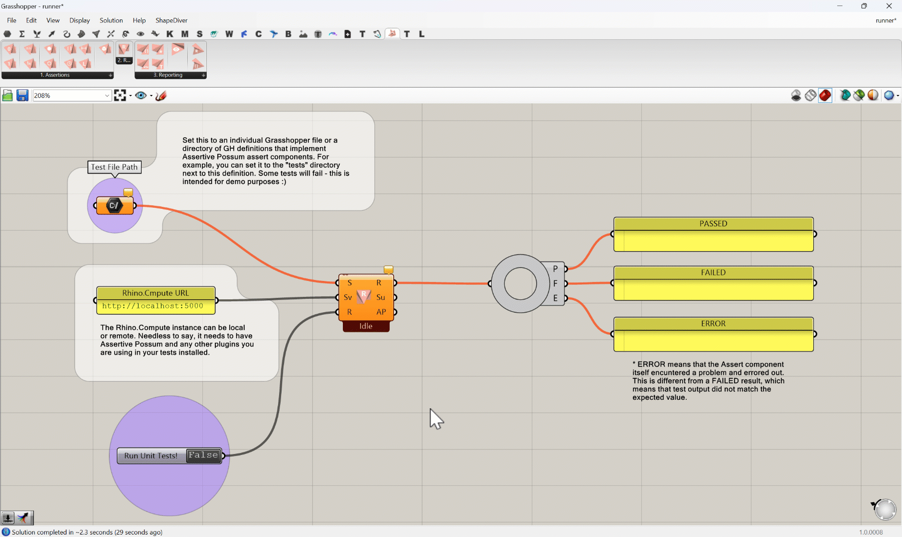
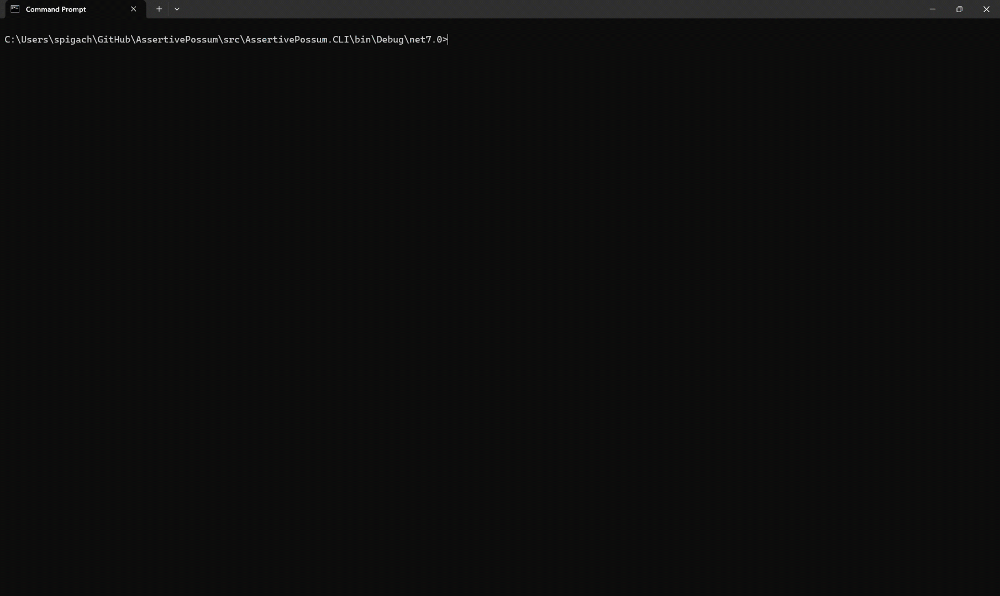

# Assertive Possum


Unit Tests for Grasshopper files? Easy! Assertive Possum is a testing framework that brings continuous integration mentality to computational design. Whom is this for?
- **Plugin authors** - You now have an easy way to check whether your latest changes broke some other features of your Grasshopper plugin.
- **Hardcore Grasshopper users** - Do you have precious definitions you've spent hundreds of hours meticulously crafting? Are you afraid to upgrade a plugin to the latest version, because it might break something in your parametric workflow? Build some Unit Tests with Assertive Possum to help you sleep better at night!

## How It Works

1. Build a `.gh` definition that uses your plugin components.
2. Wire outputs to Assertive Possum assertion components to check them against expected values.
3. Run the unit tests via the CLI or the in-Grasshopper Runner component.
4. The runner sends the definition (or many-many definitions in a folder) to Rhino.Compute, solves it, scans outputs for test results, and produces a report.



## Components

**Assertions** — `AssertEqual`, `AssertNotEqual`, `AssertTrue`, `AssertFalse`, `AssertNull`, `AssertNotNull`, `AssertListLength`, `AssertContains`, `AssertInRange`, `AssertGeometryValid`

**Reporting** — `ReportViewer`, `ReportToJUnit`, `ReportToTAP`, `ReportToJSON`, `ReportToMarkdown`, `JsonToTestResult`, `TestResultToJson`

**Runner** — `GHRunner` (in-Grasshopper test runner)

## CLI Usage
To use the CLI, make sure to either run the `assertive-possum` command from the directory where the plugin is installed, or just add that directory to PATH.

```
assertive-possum run <path> [options]
```

| Option | Default | Description |
|--------|---------|-------------|
| `--server <url>` | `http://localhost:6500` | Rhino.Compute server URL |
| `--format <fmt>` | `text` | Output format: `text`, `junit`, `tap`, `json`, `markdown` |
| `--output <file>` | stdout | Write report to file |
| `--recurse` / `--no-recurse` | `--recurse` | Recurse into subfolders |
| `--timeout <sec>` | `60` | Per-file solve timeout |
| `--parallel <n>` | `1` | Number of files to solve concurrently |
| `--verbose` | off | Show individual results for passing files |

**Exit codes:** `0` = all passed, `1` = failures, `2` = error

### CLI Examples

```bash
# Run all tests in a folder
assertive-possum run ./tests --server http://localhost:5000 --verbose

# Export JUnit XML for CI
assertive-possum run ./tests --format junit --output results.xml

# Run in parallel with custom timeout
assertive-possum run ./tests --parallel 4 --timeout 120
```



## Prerequisites

- [.NET 7 SDK](https://dotnet.microsoft.com/download/dotnet/7.0)
- A running [Rhino.Compute](https://developer.rhino3d.com/guides/compute/) instance with your plugins loaded
- [Yak CLI](https://developer.rhino3d.com/guides/yak/creating-a-rhino-plugin-package/) (for packaging only)

## Building the project

```bash
# Debug build (plugin + CLI)
dotnet build src/AssertivePossum
dotnet build src/AssertivePossum.CLI

# Release build (also creates Yak packages)
dotnet build src/AssertivePossum -c Release
```

The Release build automatically creates `.yak` packages in `Yak/dist-{version}/` and copies the cross-platform package to `linux/compute/packages/`.

## Version Management

All three projects share the same version. Bump them together:

```powershell
.\src\Bump-Version.ps1 0.2.0
```

## Examples
Check out example files [here](./examples/)